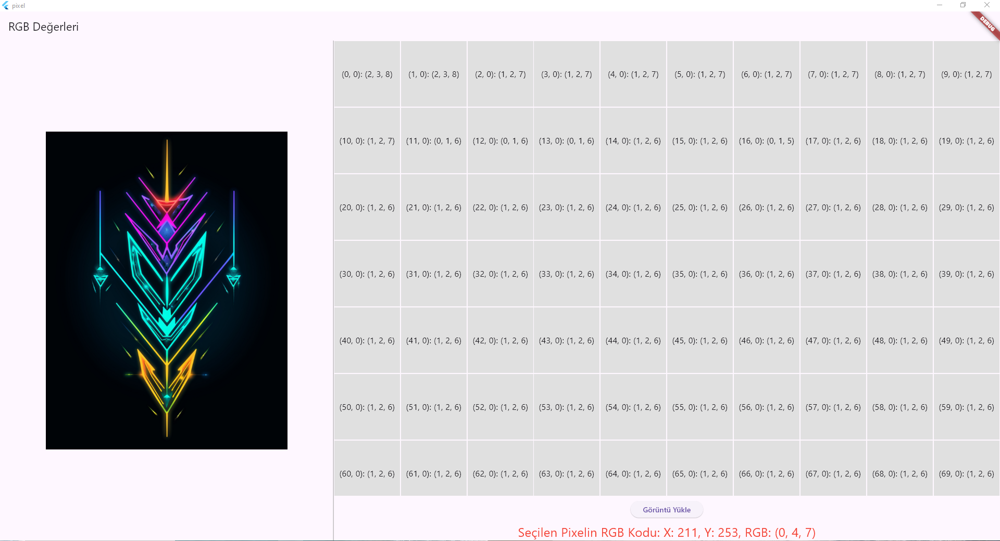

```markdown
# RGBImageApp

This Flutter app lets you load an image, view the RGB values of individual pixels by clicking on them, and display the RGB values in a matrix.

---

Bu Flutter uygulaması, bir resmi yüklemenize, piksel üzerinde tıklayarak RGB değerlerini görüntülemenize ve RGB değerlerini bir matris olarak gösterir.

## Features / Özellikler

- **Load Image from Gallery / Galeriden Resim Yükleme:** 
   Select an image from the gallery to display on the app and access pixel data.
   Uygulamada gösterilecek bir resmi galeriden seçerek piksel verilerine erişin.
  
- **View Pixel RGB Value / Piksel RGB Değerini Görüntüleme:** 
   Tap on any pixel in the loaded image to see its exact RGB color values.
   Yüklenen resimde herhangi bir piksele tıklayarak tam RGB renk değerini görün.

- **RGB Matrix Display / RGB Matris Gösterimi:** 
   Shows a grid view of RGB values for each pixel.
   Her pikselin RGB değerlerini bir grid görünümünde gösterir.

## Installation / Kurulum

1. Clone the repository:
   ```
   git clone https://github.com/yourusername/RGBImageApp.git
   ```
   
2. Install dependencies:
   ```
   flutter pub get
   ```

3. Run the app:
   ```
   flutter run
   ```

## Dependencies / Bağımlılıklar

- [image_picker](https://pub.dev/packages/image_picker): Selects images from the gallery.
- [auto_size_text](https://pub.dev/packages/auto_size_text): Adjusts text size automatically based on the container size.

## Usage / Kullanım

1. Tap the **Load Image** button to open the gallery and select an image.
2. Once the image loads, tap on any pixel to view its RGB values in the display area.
3. The entire image’s RGB values will be displayed in a matrix on the right.

---

1. **Görüntü Yükle** düğmesine tıklayarak galeriyi açın ve bir görüntü seçin.
2. Görüntü yüklendikten sonra, herhangi bir piksele tıklayarak RGB değerlerini görüntü alanında görün.
3. Tüm resmin RGB değerleri sağdaki matriste gösterilecektir.

## Screenshots / Ekran Görüntüleri



## License / Lisans

This project is licensed under the MIT License. See [LICENSE](LICENSE) for more details.
Bu proje MIT Lisansı ile lisanslanmıştır. Ayrıntılar için [LICENSE](LICENSE) dosyasına bakın.
```

